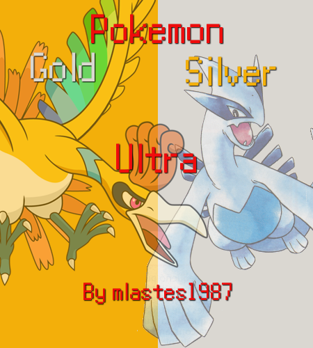

# Pokémon Gold and Silver Ultra

Based on the [**pokegold**](https://github.com/pret/pokegold) disassembly by pret.

# Features Currently Implemented

- **Gen 6 Exp. Share and Experience system:** After getting your Pokedex and fighting your rival, Prof. Elm's Aide will give you the EXP Share with your Poke Balls which will allow you to toggle on/off to share EXP points with your team.
- **Kurt makes pokeballs instantly**
- **Master Ball/Rare Candy Twins:** In Cherrygrove City, two Youngster NPCs will be in the lower left corner below the Old Man's house to give you 99 Master Balls and Rare Candies respectively.
- **Tradeback NPC:** For all trade evolutions, go to B1F of the Goldenrod Department Store to trade them with a Youngster NPC.
- **Level Up Moveset Changes:** The starters, and soon various other mons have some changes to their level up movesets.

Coming soon...
